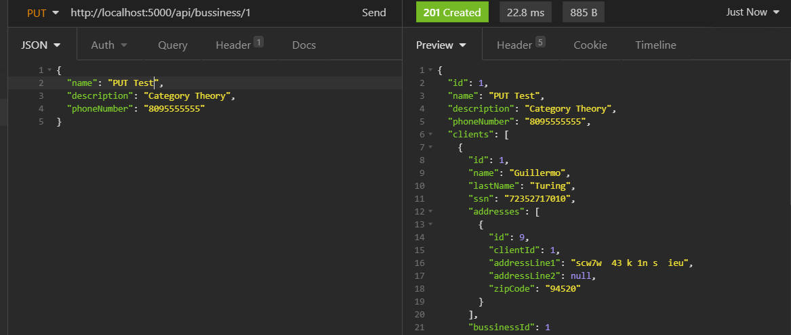

# Programming Test 2

Prueba Técnica a desarrollar:

Se desea tener el control de todos los clientes pertenecientes a la empresa X,
donde cada cliente puede tener N cantidad de direcciones.
Se solicita crear una solución para este problema.

La solución debe de ser entregada en un repositorio GIT público.

### Data

  - [Entity Framework Core](https://docs.microsoft.com/en-us/ef/core/get-started/overview/first-app?tabs=netcore-cli)
  - Base de datos "InMemory" (Para facilitar ejecutar el demo en otros equipos)
  - Se implementan los patrones de diseño Repository y Unit Of Work

### Backend

  - [ASP.NET Core](https://docs.microsoft.com/en-us/aspnet/core/?view=aspnetcore-5.0)
  - Enpoints REST para manejar "bussinesses" (empresas), "clients" (clientes) and "addresses" (direcciones)

## Demo

Ejecutar el script demo.bat en windows o seguir los pasos siguientes:

## Build and run Backend

Abrir la solución en Visual Studio, Seleccionar el proyecto Backend y ejecutarlo.
Elegir el perfil 'Backend' (Tiene puertos correctos configurados en caso de tener un frontend).

O, si se prefiere, publicarlo y ejecutarlo desde la linea de comandos (Esto es lo que hace el script demo.bat)

```batch
cd ProgrammingTest2
dotnet publish Backend -c Release -r win-x64 -o %USERPROFILE%/Desktop/Backend"
```

Cambiar al directorio con el output (en este caso Desktop/Backend) y ejecutar Backend.exe.

## Build and run frontend

```batch
cd frontend
npm install
npm run build
npm run demo
```

Luego acceder al sitio ```http://localhost:3000```
El programa del Backend debe estar ejecutandose

## ScreenShots

### GET


### POST


### PUT



### DELETE


