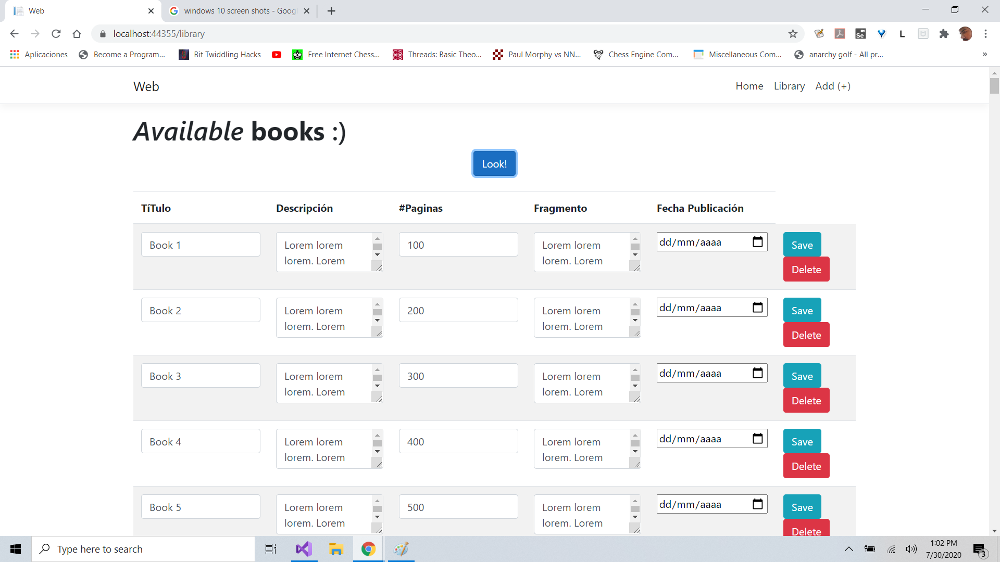
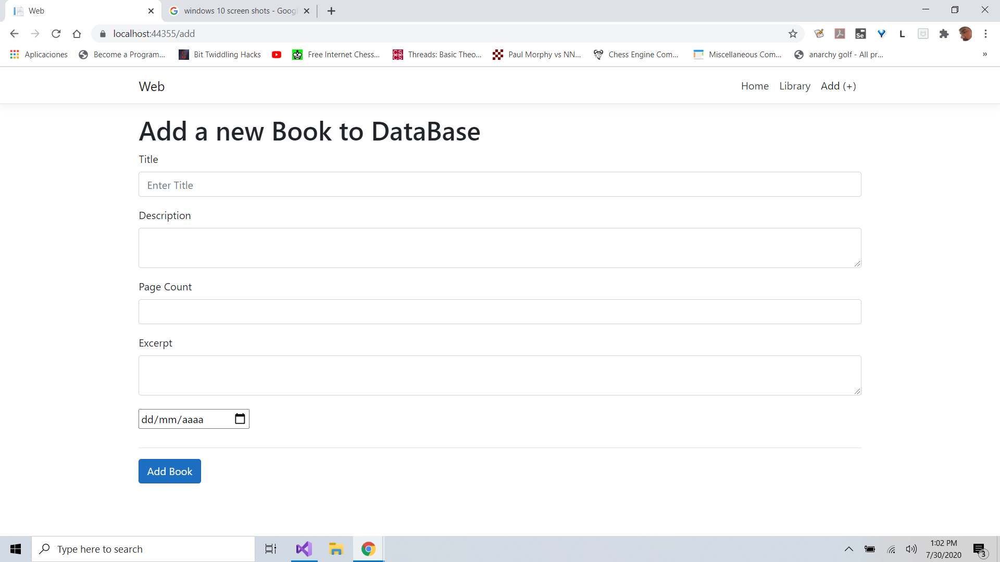

# Ejercicio de Programación
### API REST

Usando el api de [Fake Rest API](https://fakerestapi.azurewebsites.net/swagger/ui/index#/Books) crear Un Endpoint REST

### Disclaimer

No me ha dado tiempo de implementar las funcionalidades para modificar los registros en la UI con React
pero los endpoints estan implementados.

### EndPoints

- ``` GET /api/Books ```
- ``` GET /api/Books/{id} ```
- ``` POST /api/Books ```
- ``` PUT /api/Books/{id} ```
- ``` DELETE /api/Books/{id} ```

Tambien esta implementada la interfaz en javascript para tocar dichos endpoints

### Javascript

```javascript
import { Books } from '../api/api';

Books.Get();        // GET    /api/Books
Books.Get(5);       // GET    /api/Books/5
Books.Add(book);    // POST   /api/Books
Books.Update(book); // PUT    /api/Books/{book.id}
Books.Remove(5);    // DELETE /api/Books/5

```

### Build and Run
```batch
cd RestApiExercise
dotnet build
dotnet run --project Web
```
Acceder a localhost:5000/


### ScreenShots



