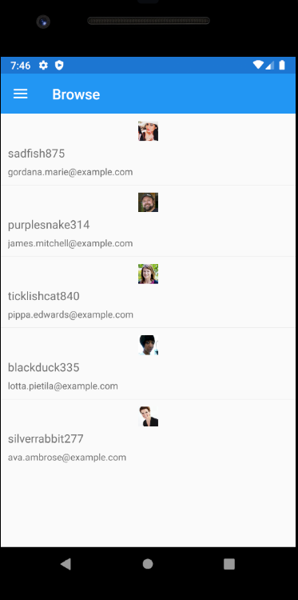
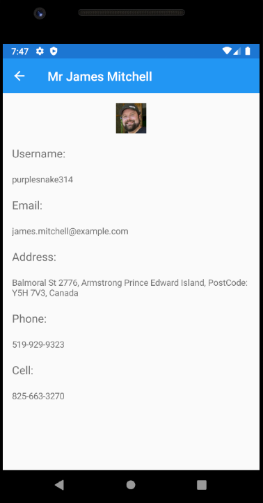
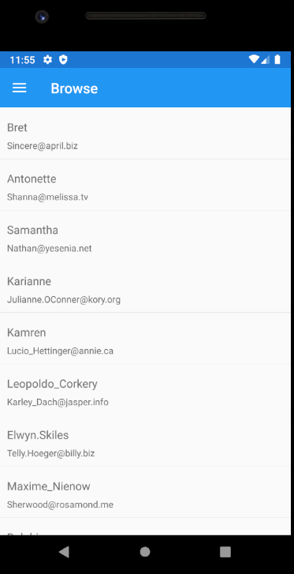
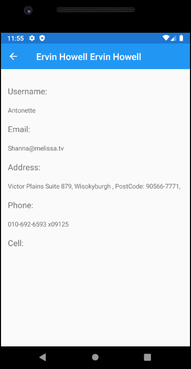

# TestingXamarin
Ejercicio de programación para probar y descubrir Xamarin

Consume el api [randomuser.me](https://randomuser.me/) y [jsonplaceholder](https://jsonplaceholder.typicode.com/users) para presentar una lista de usuarios y detalles de cada uno.

### Uso
  - Swipe down para actualizar la lista
  - Tap en el usuario para ir a una vista de detalles

### Vistas usando randomuser.me

### Vistas usando jsonplaceholder.typicode.com

